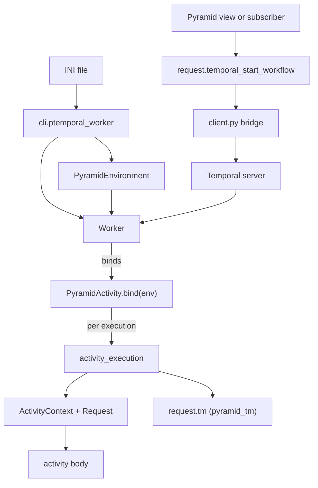

# Architecture

A Pyramid library (its own package, consumed via `config.include('pyramid_temporal')`) that
binds Pyramid's configuration and transaction model to Temporal. Activities run with real
Pyramid requests and `pyramid_tm` transactions, and Pyramid code starts and signals
workflows without dealing with asyncio.

## Package Structure

```
pyramid_temporal/
├── __init__.py            # includeme, settings defaults, request methods, public API
├── activity.py            # @activity.defn, PyramidActivity, bind() -> Temporal activity
├── execution.py           # activity_execution: one request + one transaction per execution
├── context.py             # ActivityContext, RegistryContext (threadlocal scopes)
├── environment.py         # PyramidEnvironment: wrapper around pyramid bootstrap output
├── worker.py              # Worker: binds activities, owns the sync activity thread pool
├── transaction_manager.py # is_transaction_active, safe_commit, safe_abort
├── client.py              # sync -> async bridge for start_workflow / signal_workflow
└── cli.py                 # ptemporal-worker: bootstrap an INI file and run a worker factory
```

## Core Design Decisions

### Two directions, two entry points

Pyramid to Temporal (starting and signalling workflows) goes through `client.py` and the
request methods registered in `includeme`. Temporal to Pyramid (activities needing a
request, a session, and a transaction) goes through `worker.py`, `activity.py`, and
`execution.py`. The two halves share only the registry and the settings.

### The environment is the unit of Pyramid context

`PyramidEnvironment` wraps `pyramid.paster.bootstrap` output (registry, app, request, root,
closer) and is what a worker is built from. It is deliberately a value object: activities get
the registry from it and build their own request per execution, rather than reusing the
bootstrap request. When `env.request` is present, its `environ` is copied into each activity
request, which is how tests inject a shared session or transaction manager.

### One activity execution is one unit of work

Registering an activity binds it to the environment, and each call of the bound activity
creates its own `ActivityContext`, request, and transaction. Nothing is shared between
executions, so `max_concurrent_activities` above 1 is safe. See `knowledge/activities.md`
for the full model, including the sync and async flavours and the threadlocal semantics.

### Configuration lives in the registry, never at import time

`includeme` defaults the `pyramid_temporal.*` settings, optionally connects a client into
`registry['temporal_client']`, and registers the request methods. Nothing is configured at
module import, so the package stays inert until included.

### The library never owns transaction policy

Transactions are `pyramid_tm`'s: the execution uses `request.tm` if the application
configured `pyramid_tm`, and runs without transaction management if it did not.
`transaction_manager.py` only adds tolerance for doomed transactions, which is what makes
test suites that abort everything work unchanged.

## Component Relationships


